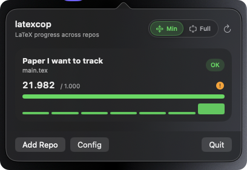
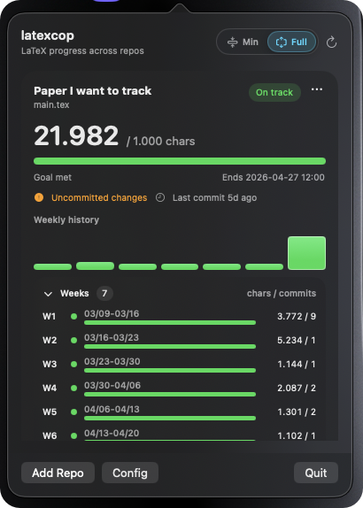
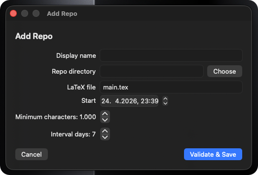

# 👮 latexcop

[](https://www.python.org)
[](LICENSE)
[](https://docs.astral.sh/ruff/)

*Stop guessing. Start tracking. Your LaTeX progress, (semi) automated.*

---

> **The problem:** Many academic courses require continuous weekly progress on your paper — *"Write at least 1000 characters per week!"* — but manually checking this is tedious and error-prone.
>
> **The fix:** Point **latexcop** at your Git repository. It walks your commit history, strips LaTeX comments, and tells you *exactly* how many real character changes you've made.

<p align="center">
  
</p>

## 🔍 How It Works

```
  Git Commits  →  latexcop  →  Progress Table + CSV
  (your repo)     (compares)   (per period)
```

1. You write your LaTeX paper in a **Git repository** — [Overleaf has built-in Git support](https://docs.overleaf.com/integrations-and-add-ons/git-integration-and-github-synchronization/git-integration) — and commit regularly.
2. You point latexcop at that repo via a simple `.env` file.
3. It compares snapshots of your `.tex` file period by period and counts **real characters** changed — ignoring `% comments`.
4. You get a clean progress table and a CSV export.

## ✨ Features

- 🔄 **Automated Tracking** — fetches remote commits and computes character diffs per period
- ⌨️ **CLI Interface** — override environment variables via command-line arguments
- 🧹 **Comment Stripping** — LaTeX comments (`% …`) are ignored so you can't game the stats
- ⚠️ **Safety Warnings** — alerts you about uncommitted changes or a diverged branch
- 📊 **CSV Export** — saves weekly results to `progress.csv`
- 🧮 **Commit Counts** — tracks commits touching the configured file per period
- 🖥️ **Native macOS Menu Bar App** — optional SwiftUI wrapper for tracking multiple repos
- ⚙️ **Fully Configurable** — any repo, any file, any interval (weekly / biweekly / monthly)

## 🚀 Quickstart

### Prerequisites

- **Python 3.12+**
- **Git**
- [**uv**](https://github.com/astral-sh/uv) — the blazing-fast Python package manager

### 1. Clone & configure

```bash
git clone https://github.com/jb381/latexcop.git
cd latexcop
cp .env.example .env
```

Edit `.env` — set REPO_DIR and START_DATE

### 2. Run

You can run it using the default configuration from your `.env` file:

```bash
uv run progress_tracker.py
```

Or override any setting via the command line:

```bash
uv run progress_tracker.py --start-date "2024-01-01 12:00:00" --min-chars 1500
```

For app integrations, emit machine-readable JSON:

```bash
uv run progress_tracker.py --json --no-auto-pull
```

### 3. Profit

```
🎯 Current Period 2 Progress: 1423/1000 chars (Goal met! 🎉)
--------------------------------------------------------------------------------
Period | Start Date       | End Date         | Diff   | Commits | Target Met | Locked
--------------------------------------------------------------------------------
1      | 2025-01-06 12:00 | 2025-01-13 12:00 | 1087   | 3       | Yes        | Yes
2      | 2025-01-13 12:00 | 2025-01-20 12:00 | 1423   | 4       | Yes        | No (Current)
--------------------------------------------------------------------------------
```

## ⚙️ Configuration

All settings live in `.env` **OR** can be passed as CLI arguments. Copy `.env.example` to get started:

| Variable | CLI Argument | Description | Default |
|---|---|---|---|
| `START_DATE` | `--start-date` | First period start date (`YYYY-MM-DD HH:MM:SS`) | — *(required)* |
| `REPO_DIR` | `--repo-dir` | Absolute path to your Git repository | — *(required)* |
| `FILE_PATH` | `--file-path` | LaTeX file path, relative to `REPO_DIR` | `main.tex` |
| `CSV_OUT` | `--csv-out` | Output CSV filename | `progress.csv` |
| `MIN_CHARS` | `--min-chars` | Minimum character diff required per period | `1000` |
| `INTERVAL_DAYS` | `--interval-days` | Period length in days (`7`=weekly, `14`=biweekly) | `7` |

CLI-only options:

| Argument | Description |
|---|---|
| `--json` | Print structured JSON instead of CSV/table output |
| `--no-auto-pull` | Skip fetch and fast-forward merge before calculating progress |

## 🖥️ macOS Menu Bar App

latexcop includes a native SwiftUI menu bar app for tracking multiple LaTeX repos at once. It bundles the tracker code and shells out through `uv`, so `uv`, Python, and Git still need to be installed on the Mac.

<p align="center">
  
  
</p>

### Install From DMG

Download `Latexcop-<version>.dmg` from a GitHub Release, open it, and drag `Latexcop.app` into `Applications`.

The current DMG is unsigned and not notarized. macOS may show a Gatekeeper warning for downloaded builds; for now this is best treated as a beta/internal release.

### Build Locally

```bash
cd macos/Latexcop
./build-app.sh
open .build/release/Latexcop.app
```

Build a DMG locally:

```bash
./package-dmg.sh dev
open .build/dist/Latexcop-dev.dmg
```

Or build and copy it to `~/Applications`:

```bash
./build-app.sh --install
open ~/Applications/Latexcop.app
```

To install into the system Applications folder instead, run:

```bash
./build-app.sh --install-system
open /Applications/Latexcop.app
```

### Releasing

GitHub Actions builds a DMG automatically for tags beginning with `v`:

```bash
git tag v0.1.0
git push origin v0.1.0
```

The workflow publishes `Latexcop-<tag>.dmg` to a GitHub Release. For a public release, add Apple Developer ID signing and notarization to `.github/workflows/release-macos.yml` first.

The app stores tracked repos at:

```text
~/Library/Application Support/latexcop/config.json
```

Use **Add Repo** from the menu bar popover to configure a repo with native controls:

- Display name
- Git repo folder picker
- LaTeX file picker scanned from the selected repo, defaulting to `main.tex` when found
- Start date/time
- Minimum characters
- Interval days

Use **Edit** on a repo card to adjust those settings later. The app validates that the selected folder is a Git repo, the tracked file exists, and the tracker can produce JSON before saving. It refreshes by running `uv run progress_tracker.py --json --no-auto-pull` for each configured repo.

The menu bar item uses the cop emoji with aggregate status, for example `👮 2/3`. Each repo card shows the current period, commit freshness, uncommitted-change status, a compact weekly sparkline, and a collapsible week-by-week history using the same records as the CLI table. Use the **Minimal** toggle for a smaller glanceable dashboard; right-click a minimal row for Edit/Open/Remove actions.

If the app cannot find `progress_tracker.py`, launch it with `LATEXCOP_ROOT` set to this repository path:

```bash
LATEXCOP_ROOT=/path/to/latexcop open macos/Latexcop/.build/release/Latexcop.app
```

## 📂 Project Structure

```
latexcop/
├── progress_tracker.py    # Main professional script
├── macos/Latexcop         # Native SwiftUI menu bar wrapper
├── pyproject.toml         # Project metadata & Ruff config
├── .env.example           # Example configuration
├── LICENSE                # MIT License
└── README.md
```

## 🤝 Contributing

Contributions, issues, and feature requests are welcome! Feel free to open an issue or submit a pull request.

## 📄 License

[MIT](LICENSE) — use it, fork it, make it yours.
